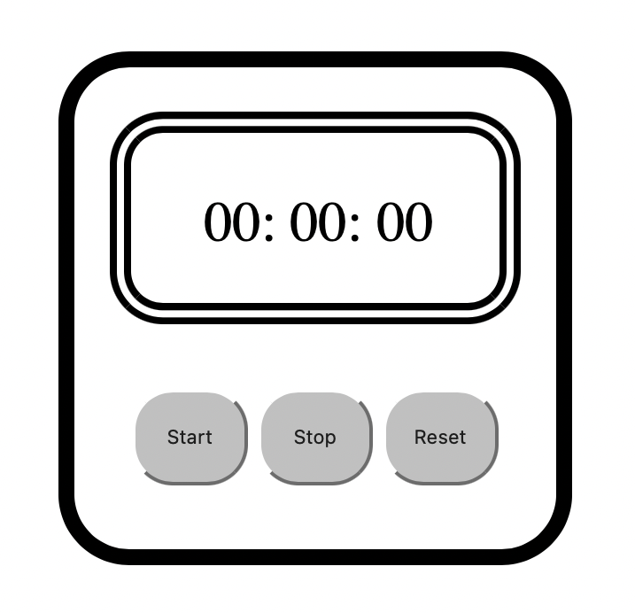

<h1> STOP WATCH</h1>

[link to hosting](https://nishant-l.github.io/Timer/)

<h3>ScreenShot of stopWatch</h3>

1. Use Start button to start

2. use Stop button to stop to start from the point you stop click on start again

3. Use reset button to reset